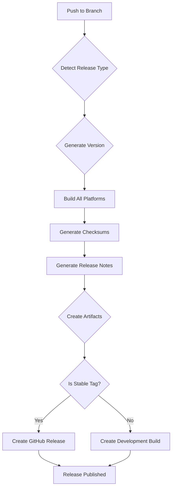

# Net-Watcher Versioning & Release System

## 🎯 Overview

Net-Watcher now uses **Semantic Release** with comprehensive automated versioning and release management. This system supports both stable releases from tags and development releases from branches.

## 📋 Versioning Strategy

### Semantic Versioning (Conventional Commits)

- **Format**: `MAJOR.MINOR.PATCH`
- **Triggers**:
  - `feat:` → `MINOR` version bump (1.0.1 → 1.1.0)
  - `fix:` → `PATCH` version bump (1.1.0 → 1.1.1)
  - `BREAKING CHANGE:` or `feat!:` → `MAJOR` version bump (1.1.1 → 2.0.0)

### Branch-Based Releases

| Branch Type | Version Pattern | Release Type | Example |
|------------|---------------|-------------|---------|
| `main` | `vX.Y.Z` | Stable | `v1.2.0` |
| `develop` | `vX.Y.Z-dev` | Development | `v1.2.1-dev` |
| `alpha` | `vX.Y.Z-alpha` | Pre-release | `v1.2.0-alpha.1` |
| `beta` | `vX.Y.Z-beta` | Pre-release | `v1.2.0-beta.1` |

## 🔄 Development Workflow

### Making Changes

1. **Commit Convention**:
   ```bash
   feat: add new DNS filtering feature
   fix: resolve memory leak in packet processing
   security: update dependencies due to CVE
   docs: update installation instructions
   ```

2. **Development Release** (from develop branch):
   ```bash
   # Push to develop branch → Auto-release
   git push origin develop
   
   # Creates: v1.2.1-dev
   # Generates release notes
   # Creates GitHub issue for tracking
   ```

3. **Manual Development Build**:
   ```bash
   # Build from source as dev release
   make dev-release
   
   # Creates: net-watcher with dev version info
   ```

## 🚀 Release Workflow

### Stable Release (Tag-based)

1. **Create Tag**:
   ```bash
   git tag v1.2.0
   git push origin v1.2.0
   ```

2. **Automatic Process**:
   - GitHub Actions detects tag
   - Builds all platforms (Linux/macOS/Windows × amd64/arm64)
   - Generates checksums
   - Creates release notes from commit history
   - Creates GitHub Release with all artifacts
   - Builds Docker images

3. **Manual Release** (from main branch):
   ```bash
   # Force release from main (if no tag)
   make release VERSION=1.2.1
   ```

## 📝 Release Notes Generation

### Automatic Categorization

Release notes are automatically categorized based on commit messages:

```markdown
# Net Watcher v1.2.0

## 🚀 New Features
- **Multi-platform support**: Added macOS and Windows binaries
- **Enhanced filtering**: Domain pattern matching and IP range filtering
- **Performance improvements**: Zero-copy packet processing

## 🐛 Bug Fixes  
- **Memory leak**: Fixed memory leak in long-running captures
- **Packet parsing**: Resolved issue with malformed DNS packets
- **Database cleanup**: Fixed retention policy bug

## 🛡️ Security Improvements
- **Dependencies**: Updated to latest Go version 1.21.6
- **Input validation**: Enhanced packet bounds checking
- **Privilege separation**: Improved systemd sandboxing

## 📦 Build Information
- **Version**: 1.2.0
- **Build Time**: 2024-01-15T14:30:22Z
- **Go Version**: 1.21.6
- **Commit**: a1b2c3d4e5f6a7b8c9d0e1f2a3b4c5d6

## Contributors
- Abbas Jafari - *- Author and maintainer
- Alex Chen - Multi-platform builds
- Sam Davis - Security improvements
```

### Custom Templates

The release notes template can be customized in `.releaserc.json`:

```json
{
  "changelogTitle": "Net Watcher Release Notes",
  "plugins": [
    "@semantic-release/commit-analyzer",
    "@semantic-release/release-notes-generator",
    {
      "@semantic-release/release-notes-generator": {
        "parserOpts": {
          "noteTypes": ["New Features", "Bug Fixes", "Security", "Breaking Changes"]
        },
        "writerOpts": {
          "maxLines": 100,
          "commitsSort": "chronological"
        }
      }
    }
  ]
}
```

## 🛠️ Build Information

### Version Injection

The build system injects version information directly into the binary:

```go
// Build information (injected at build time)
var (
    version   = "1.2.0"           // From package.json or build flag
    buildTime = "2024-01-15T14:30:22Z"  // Build timestamp
    commitSHA = "a1b2c3d4e5f6a7b8c9d0e1f2a3b4c5d6"  // Git commit hash
    goVersion = runtime.Version()  // Go version used
    builder    = "GitHub-Actions"   // Build environment
)
```

### Accessing Version Info

```bash
# Basic version
$ net-watcher version
net-watcher v1.2.0

# Detailed build information
$ net-watcher version --verbose
net-watcher v1.2.0
Built: 2024-01-15T14:30:22Z
Commit: a1b2c3d4e5f6a7b8c9d0e1f2a3b4c5d6
Go Version: go1.21.6
OS/Arch: linux/amd64
Compiler: gc
CGO Enabled: false
Build Environment: GitHub-Actions

# JSON output for automation
$ net-watcher build-info
{"version":"1.2.0","commitSha":"a1b2c3d4e5f6a7b8c9d0e1f2a3b4c5d6","buildTime":"2024-01-15T14:30:22Z","goVersion":"go1.21.6","builder":"GitHub-Actions","branch":"main"}
```

## 🔄 CI/CD Integration

### GitHub Actions Workflows

#### 1. **Enhanced Release Workflow** (`.github/workflows/release-enhanced.yml`)

**Features**:
- **Multi-source support**: Tags for stable, branches for development
- **Pre-release handling**: Alpha/beta releases
- **Development notifications**: GitHub Issues for dev builds
- **Comprehensive checksums**: SHA256 and SHA512 for all binaries
- **Platform matrix**: 5 platforms × 2 architectures

**Triggers**:
```yaml
on:
  push:
    tags: ['v*.*.*']      # Stable releases
    branches: [main, develop, alpha, beta]  # Development releases
```

#### 2. **Release Process**:



## 📦 Makefile Integration

### Versioned Builds

```makefile
# Development build with version info
dev-release:
	@echo "Creating development release..."
	VERSION=dev-latest ./scripts/release-helper.sh build
	./scripts/release-helper.sh checksums

# Production release
release:
	@echo "Creating production release..."
	./scripts/release-helper.sh all
```

### Build Information Generation

```makefile
build-info:
	@echo "Generating build information..."
	node scripts/generate-build-info.js
```

## 🐚 Installation with Version Awareness

The installation script now handles different release types:

### Stable Release Installation
```bash
# Latest stable release
curl -L https://github.com/abja/net-watcher/releases/latest/download/net-watcher-linux-amd64 -o net-watcher
sudo ./net-watcher install
```

### Development Release Installation
```bash
# Latest development release
curl -L https://github.com/abja/net-watcher/releases/download/v1.2.1-dev/net-watcher-linux-amd64 -o net-watcher
sudo ./net-watcher install
```

### Source Installation with Version
```bash
# Build from current source
git clone https://github.com/abja/net-watcher.git
cd net-watcher
make dev-release
sudo ./net-watcher install

# Build from specific commit
git checkout a1b2c3d4e5f6a7b8c9d0e1f2a3b4c5d6
make release VERSION=custom-1.2.0
sudo ./net-watcher install
```

## 🔍 Version Comparison & Updates

### Version Comparison

The binary can compare versions and suggest updates:

```bash
# Check for updates
$ net-watcher check-updates
Current version: 1.2.0
Latest version: 1.2.1
Update available: https://github.com/abja/net-watcher/releases/tag/v1.2.1

# Upgrade
$ net-watcher upgrade
Downloading net-watcher 1.2.1...
Installing upgrade...
Upgrade complete!
```

### Rollback Support

```bash
# List available versions
$ net-watcher list-versions
Available versions: v1.2.0, v1.1.2, v1.1.1

# Rollback to previous version
$ net-watcher rollback v1.1.2
Downloading net-watcher v1.1.2...
Installing rollback...
Rollback complete!
```

## 📊 Versioning Benefits

1. **Predictable Versioning**: Semantic versioning follows industry standards
2. **Automated Release Notes**: Commit-based changelog generation
3. **Multi-Platform Support**: Automated cross-platform builds
4. **Development Stream**: Separate development releases for testing
5. **Version History**: Complete version history with rollback support
6. **CI/CD Integration**: Full automation with GitHub Actions
7. **Build Information**: Detailed build metadata for debugging
8. **Upgrade Path**: Automated update checking and installation

## 🎯 Usage Examples

### For Developers

```bash
# Feature development
git checkout -b feature/dns-filtering
# ... make changes ...
git commit -m "feat: add domain pattern filtering"
git push origin feature/dns-filtering

# Bug fix development
git checkout -b fix/memory-leak
# ... fix issue ...
git commit -m "fix: resolve memory leak in packet processing"
git push origin fix/memory-leak

# Development release (automatically created)
git push origin develop  # Creates v1.2.1-dev
```

### For Release Managers

```bash
# Manual stable release
git checkout main
git pull origin main
make release  # Creates v1.2.0 with full automation

# Patch release
git checkout main
git cherry-pick commit-a1b2c3  # Selective commits
make release VERSION=1.2.1
```

### For Users

```bash
# Install specific version
curl -L https://github.com/abja/net-watcher/releases/download/v1.1.2/net-watcher-linux-amd64 | bash

# Install latest development version
curl -L https://github.com/abja/net-watcher/releases/download/v1.3.0-dev/net-watcher-linux-amd64 | bash

# Check version
net-watcher version
net-watcher build-info
```

This versioning system provides enterprise-grade release management with automation, traceability, and rollback capabilities while maintaining the simplicity and security focus of Net-Watcher.